# [第二天](./day2.md)

1. [上午](#1)
2. [下午](#2)
3. [](#3)
4. [](#4)  
## 1

_上午_，制作一个会移动的小球。

### 1.1 开发环境介绍：


需要安装的开发工具有：Visual Studio22 + Unity2018 + Unity Hub(用于管理开发项目，一部电脑可以有不同的Unity版本)。

- 设置Unity与VS的关联: 选择```Edit```->```Preferences```->点击```External Script Editor```选择文件目录(也就是VS的安装目录)->按图中位置选择```devenv.exe```

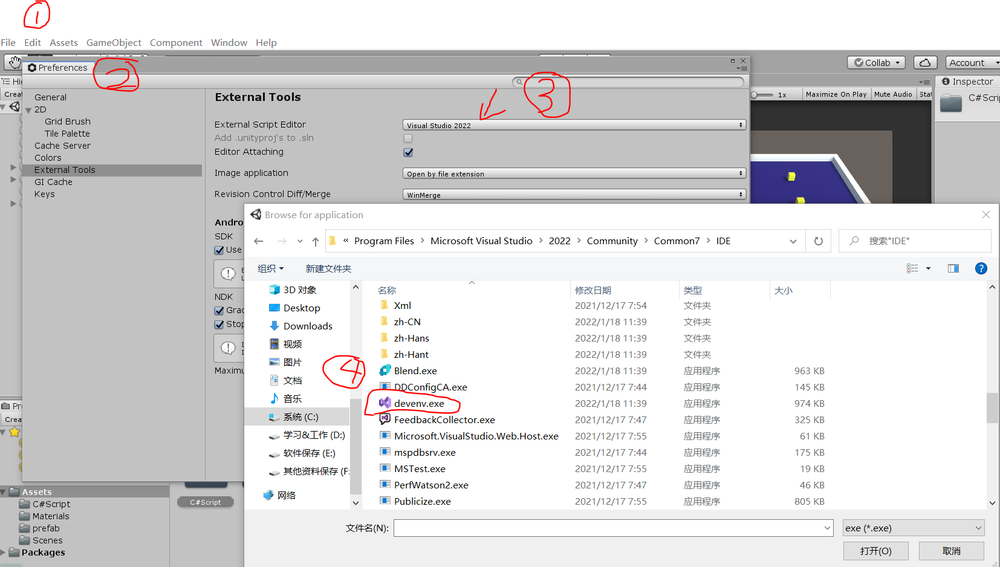

- 界面调整(使便于开发查看)：序号1到4分别为Scene开发者窗口、游戏玩家视角、项目组成目录以及控制台输出用于查看脚本本件的error

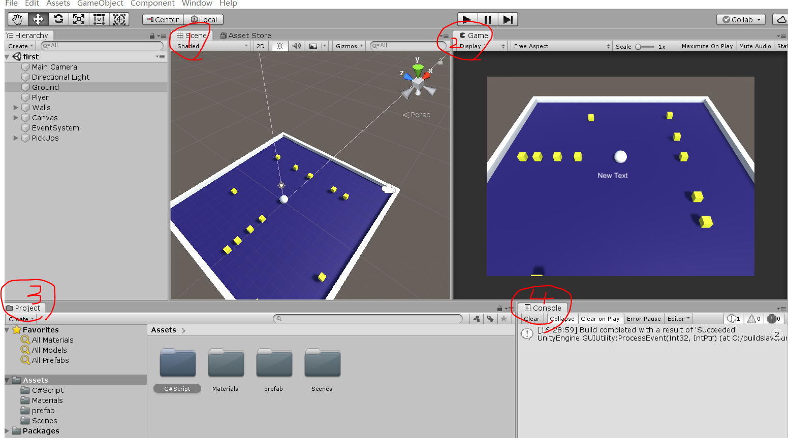

- 为不同类型文件创建文件夹便于管理：```C#Script```用于保存本项目所有的脚本文件、```Materials```用于保存所有材质球(下午用，用于给物体设置材质)、```prefeb```用于保存会多次使用的物体(下午用)以及```Scence```用于所有场景保存(今天的项目只有一个场景)。

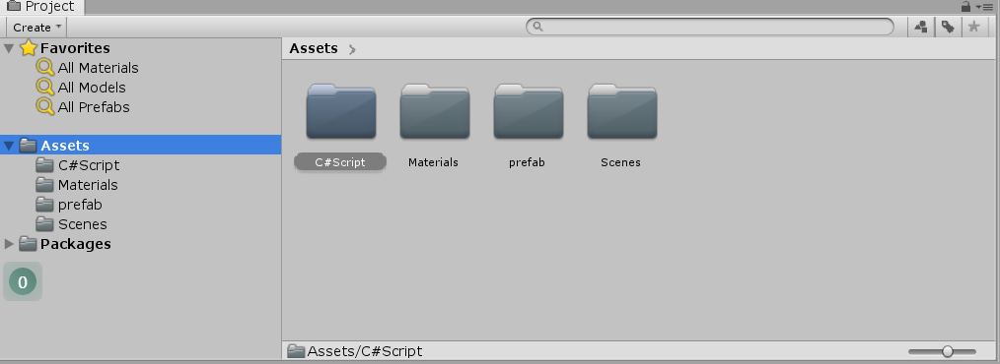

### 1.2 场景配置，放置小球和场地

- 放置地板并设置大小，这次项目是3D的，所以选择3D Object的Plane。但是Plane这个名字不好知道是什么意思，所以将其改名为```Ground```。并在Inspector中调整相应的参数。

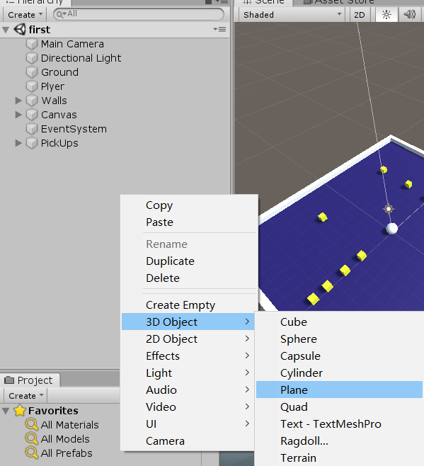

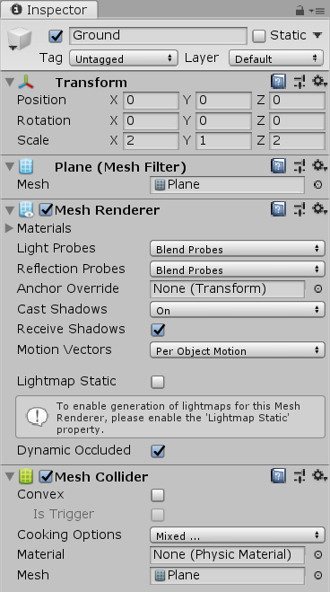

- 放置小球及基础设置，小球也是选择3D的并重命名为```Player```(毕竟是玩家要操作的对象嘛)。然后发现小球只露出了半个球，转动下镜头发现还有半个在下面！这时候将```Position```的Y轴设为0.5即可，**因为Unity是以物体中心为坐标轴，然后小球的直径为1**。

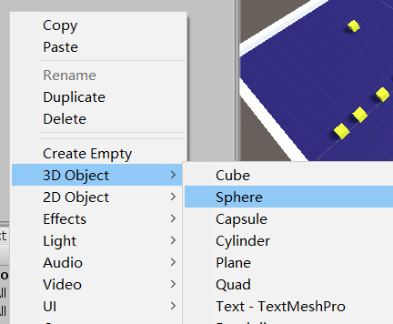

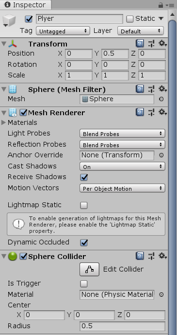

- 小球的重力设置：有了小球后，可以在Inspector中添加```Rigidbody```，即刚体属性用于小球的运动。**一定要确保是在这个球体的```Inspector```页面中点击Add ```Component```**搜索```Rigidbody```。不要选择有后缀2D**因为本次项目是3D的**。确保勾选上重力就好了。

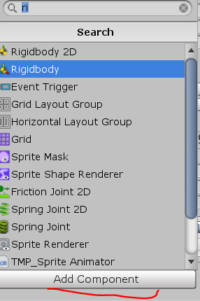

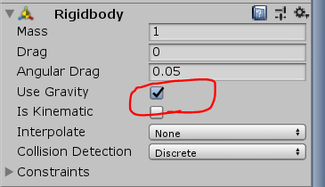

- 这时候可以测试一下，把小球放到空中，看其会不会掉下去。**地板是不需要添加```Rigidbody```属性的**，因为我们只希望地板可以安安静静躺在空间内就好了。

### 1.3 脚本编写(写代码)

- 在Project窗口新建脚本本件并命名为```PlayerController```表示这是玩家控制小球的代码

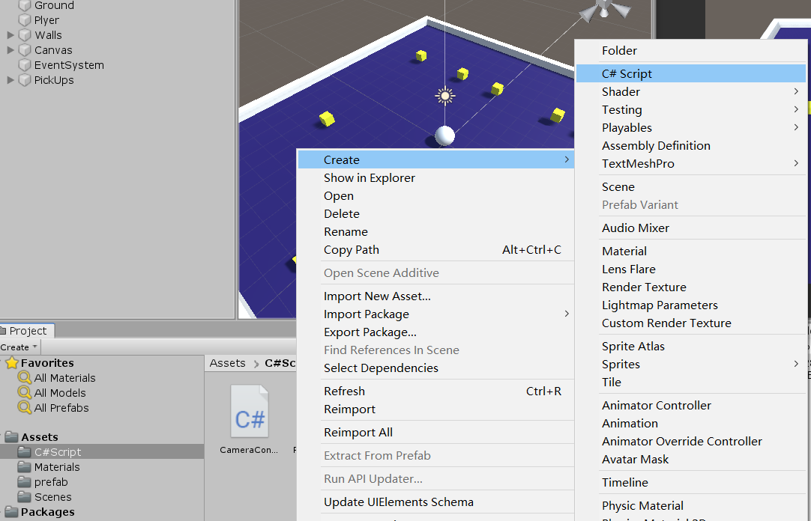

- 那么，怎么将改脚本与小球联系起来呢？把改文件直接拖入到**小球**的```Inspector```，。**Unity很多操作可以直接拖拽**，十分方便。

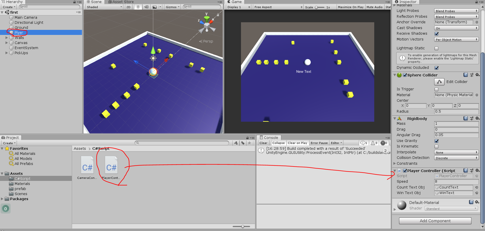

- 然后再双击该脚本本件```PlayerController```进入VS打代码。
- 如果一切无误的话，此时点击下图运行就可以通过wasd操作小球了。  

### 1.4 上午代码

```c#
using System.Collections;
using System.Collections.Generic;
using UnityEngine;

public class PlayerController : MonoBehaviour
{
    //Rigidbody  刚体 来实现移动
    private Rigidbody rb;
    public float speed;
    
    // Start is called before the first frame update
    void Start()
    {
        rb = GetComponent<Rigidbody>();
    }

    // Update is called once per frame
    void Update()
    {
        Vector3 movement;

        movement.x = Input.GetAxis("Horizontal");
        movement.y = 0;//使不能跳
        movement.z = Input.GetAxis("Vertical");//前后
        rb.AddForce(movement* speed);
    }

}

```
### 可能出现问题的地方

- 在Unity或VS中没有保存，导致脚本不正确
- 

## 2

_下午_，完成小球的关卡（吃掉12个方块游戏胜利）。

### 2.1 使小球更好移动并设置墙壁防止小球掉出边界

- 首先弄四个墙壁在边上，这样就不会掉到外边了

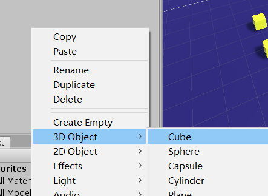

- 调好参数后，快速复制

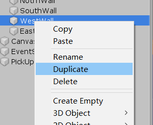

- 之后发现这四个墙除了防止小球掉下去外没什么用，而且在```Hierachy```界面又占地方，此时可以新建一个空实体把四个墙放进去

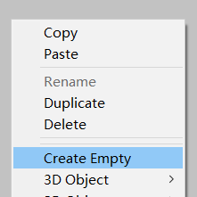

- 最终效果如下，界面干净整洁

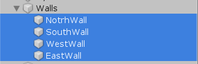

- 早上的代码中，是怎么知道```GetAxis```的参数是```Horizontal```呢？其实不管是Horizontal或者Vertical这些是有设定的。点击File->Project Setting -> Input发现有Axes属性，里面的参数正有Horizontal和Vertical。**所以这里的属性是一一对应的**，如果将Vertical修改成```MyVertical```那么在代码中也要换成对应名字。

```c#
 movement.x = Input.GetAxis("Horizontal");
```

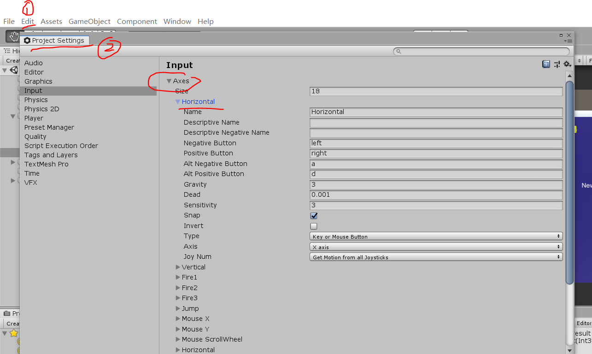

- 此外，还可以注意到```Horizontal```属性是只有正反馈和负反馈的```Negative```，也就是Horizontal只能控制左右，如果需要前后的话就需要控制另一个属性。**最终水平方向、垂直方向的共同作用下实现二维的运动**。如果要新增一个交互键，同样也在这里修改(课后练习)。

- 因为使用了```Rigidbody```，所以小球是有惯性移动的，为了更好的移动可以在```PlayerController```定义一个```public float speed;```这时候再到Unity看，发现多了一个```Speed```属性，这样就可以让策划小伙伴帮忙调试了。_如果speed没有设置成public是不会显示的，如果speed没有设值，默认为0小球也不会移动_。

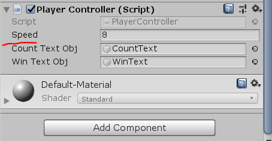

- 这时候再移动会发现稍微好了一些，并且小球也不会掉落出去


### 2.2 设置相机跟随

- 首先把相机调到一个合适的位置(用玩家视角Game)查看，可以直接调参数

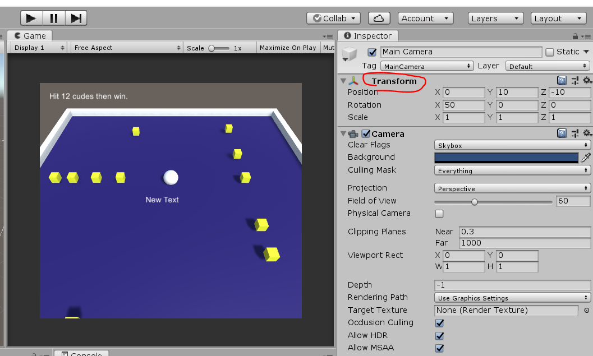

- 然后新建一个脚文(命名为```CameraController```)用于相机的控制

  ```c#
  using System.Collections;
  using System.Collections.Generic;
  using UnityEngine;
  using UnityEngine.UI;
  
  public class PlayerController : MonoBehaviour
  {
      //Rigidbody  刚体 来实现移动
      private Rigidbody rb;
      public float speed;
  
      public GameObject countTextObj;//加载分数显示
      public GameObject winTextObj;//加载分数显示
      int count;
  
      // Start is called before the first frame update
      void Start()
      {
          rb = GetComponent<Rigidbody>();
          count = 0;
          Update();
          winTextObj.GetComponent<Text>().text = "";
      }
  
      // Update is called once per frame
      void Update()
      {
          Vector3 movement;
  
          movement.x = Input.GetAxis("Horizontal");
          movement.y = 0;//使不能跳
          movement.z = Input.GetAxis("Vertical");//前后
          rb.AddForce(movement* speed);
      }
  
      /**
       *OnTriggerEnter用于检测到碰撞发生时执行的脚本，
       *在后面开发中可以往里面添加捡起武器添加到背包的操作
       */
      private void OnTriggerEnter(Collider other)
      {
          /*Debug.Log("Player 碰到了" +other.gameObject.name);*/
          if(other.gameObject.CompareTag("PickUp"))
          {
              other.gameObject.SetActive(false);
              count++;
              UpdateText();
              if(count >= 12)
              {
                  winTextObj.GetComponent<Text>().text = "You Win";
              }
          }        
      }
  
      void UpdateText() 
      {
          countTextObj.GetComponent<Text>().text = "Count:" + count.ToString();
      }
  }
  
  ```
  
  - 和小球一样，拖动改脚本到相机的```Inspector```中，**留意是相机的```Inspector```**
  
  
  
  - 这时候运行，会发现相机视角会跟随小球移动了

### 2.3 设置方块

- 因为小方块是实体便设置成```Cude```并设置好对应的材料颜色


- 现在边做边想，小方块这么小一个，可能会在其它项目会用到呢(还记得早上的prefab文件夹吗)，这时候就可以把这个方块拖动到```Project```界面，点击发现是以```prefab```为后缀的。如果以后想用，直接复制这个过去即可，方便多了。

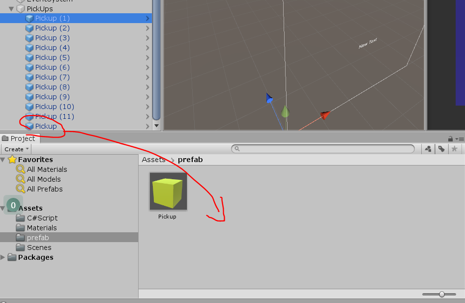

- 可以为小球设置标签，标签用途一会说到

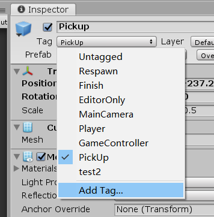

- 新建标签命名为```pickup```，和小方块同名，标签作用一目了然

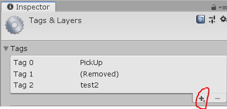

- 在```Inspector```中有```Box Collider```属性可以试着反选后操作下小球，这时候发现小球竟然会穿过小方块。所以可以知道如果反选```Box Collider```，这个小方块便可被小球穿过。
- 我们重新选择```Box Collider```然后再勾选I```s Trigger```发现此时小球又可以穿过小方块，那么这个和```Box Collider```有什么不同呢？实际上```Is Trigger```是当该物体被检测到碰撞时，便会发送信息，这时候便可以在脚本中设置代码了。比如当小球撞到方块时，改方块就消失

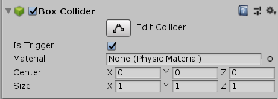

```c#
using System.Collections;
using System.Collections.Generic;
using UnityEngine;

public class PlayerController : MonoBehaviour
{
    //Rigidbody  刚体 来实现移动
    private Rigidbody rb;
    public float speed;

    // Start is called before the first frame update
    void Start()
    {
        rb = GetComponent<Rigidbody>();
        Update();
    }

    // Update is called once per frame
    void Update()
    {
        Vector3 movement;

        movement.x = Input.GetAxis("Horizontal");
        movement.y = 0;//使不能跳
        movement.z = Input.GetAxis("Vertical");//前后
        rb.AddForce(movement* speed);
    }

    /**
     *OnTriggerEnter用于检测到碰撞发生时执行的脚本，
     *在后面开发中可以往里面添加捡起武器添加到背包的操作
     */
    private void OnTriggerEnter(Collider other)
    {
        /*Debug.Log("Player 碰到了" +other.gameObject.name);*/
        if(other.gameObject.CompareTag("PickUp"))//当碰撞的标签是PickUp
        {
            other.gameObject.SetActive(false);
        }        
    }
}

```


- 一个小方块弄好了，其它的也同理，最后新建一个空的```empty```把这12个小球全部放进去，[完整的代码看最后部分](#2.6 下午代码(总))


### 2.4 设置UI

- 项目UI一共两个，一个是用于显示现在“吃掉”多少个小方块的文本框，一个是用于当“吃掉”12个小方块后显示玩家胜利的文本框

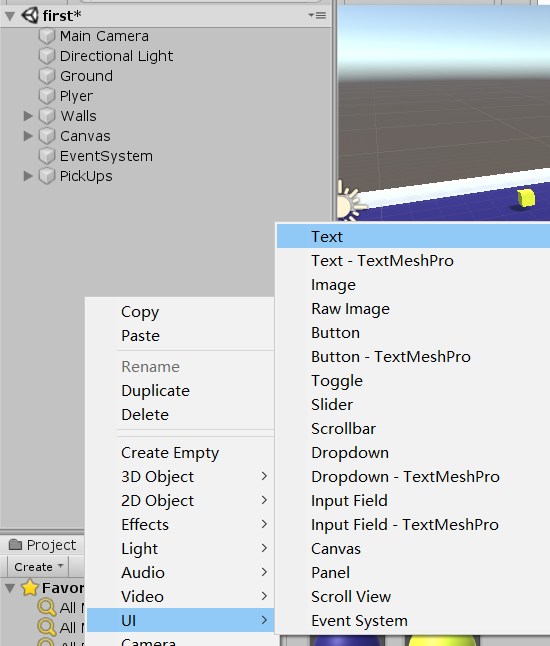

- 添加后不断缩放```Scene```界面，可以看到有一个白色的框，这个白框其实就是```Game```玩家视角，所以需要将文本框拖入这个白色大框内

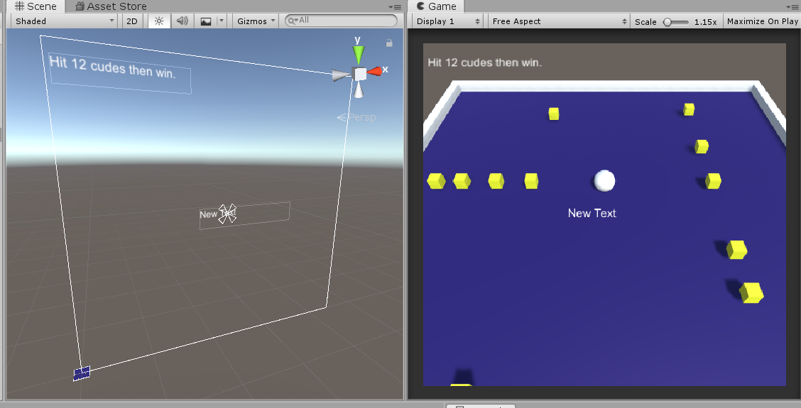

- 同样像增加speed，在```PlayerController```添加两个共有属性

```c#
public class PlayerController : MonoBehaviour
{
    //Rigidbody  刚体 来实现移动
    private Rigidbody rb;
    public float speed;

    public GameObject countTextObj;//加载分数显示
    public GameObject winTextObj;//加载分数显示
}
```

- 那么怎么将这两个文本框与玩家串联起来呢，因为控制的是小球，所以需要拖动这两个文本框到刚刚相应的```public```元素中，和```speed```一样的操作

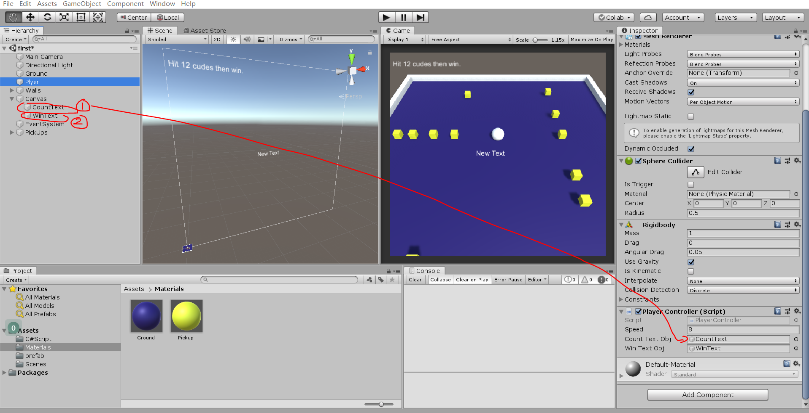

- 可以为其中一个文本框初始化内容提示玩家的任务

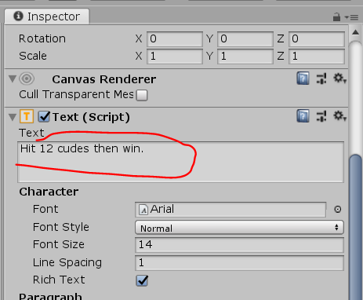

- 增加用于显示“吃掉”小方块个数的代码方便复用，[完整代码看最后](#2.6 下午代码(总))

```c#
void UpdateText() 
{
    countTextObj.GetComponent<Text>().text = "Count:" + count.ToString();
}
```


### 2.5 程序打包

- 游戏开发基本完成了，如何打包成exe文件分享给他人呢？

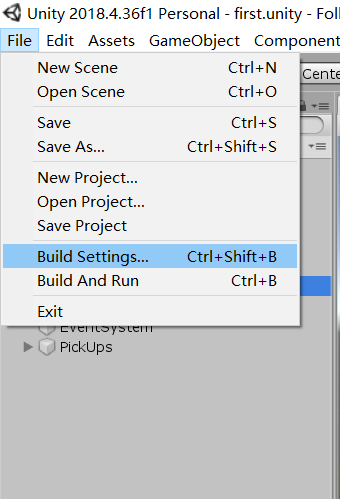

- 选择对应的```Scence```

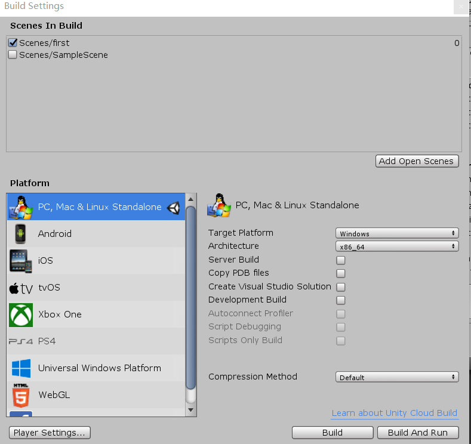

### 2.6 下午代码(总)

-  ```PlayerController.cs```小球代码

```c#
using System.Collections;
using System.Collections.Generic;
using UnityEngine;
using UnityEngine.UI;

public class PlayerController : MonoBehaviour
{
    //Rigidbody  刚体 来实现移动
    private Rigidbody rb;
    public float speed;

    public GameObject countTextObj;//加载分数显示
    public GameObject winTextObj;//加载分数显示
    int count;//用于记录“吃掉”小方块的个数

    // Start is called before the first frame update
    void Start()
    {
        rb = GetComponent<Rigidbody>();
        count = 0;
        Update();
        winTextObj.GetComponent<Text>().text = "";
    }

    // Update is called once per frame
    void Update()
    {
        Vector3 movement;

        movement.x = Input.GetAxis("Horizontal");
        movement.y = 0;//使不能跳
        movement.z = Input.GetAxis("Vertical");//前后
        rb.AddForce(movement* speed);
    }

    /**
     *OnTriggerEnter用于检测到碰撞发生时执行的脚本，
     *在后面开发中可以往里面添加捡起武器添加到背包的操作
     */
    private void OnTriggerEnter(Collider other)
    {
        /*Debug.Log("Player 碰到了" +other.gameObject.name);*/
        if(other.gameObject.CompareTag("PickUp"))//判断碰撞的是否为PickUp标签
        {
            other.gameObject.SetActive(false);
            count++;
            UpdateText();
            if(count >= 12)()//所有小方块都“吃掉了”
            {
                winTextObj.GetComponent<Text>().text = "You Win";
            }
        }        
    }

    void UpdateText() 
    {
        countTextObj.GetComponent<Text>().text = "Count:" + count.ToString();
    }
}

```
- ```CameraController.cs```摄像机代码

```c#
using System.Collections;
using System.Collections.Generic;
using UnityEngine;

public class CameraController : MonoBehaviour
{

    //相机跟随：Player每次移动，相机会跟着移动。跟着？？P移动多少距离，相机也移动相应距离
    public GameObject player;

    Vector3 offset;//三维向量

    // Start is called before the first frame update
    void Start()
    {
        offset = this.transform.position - player.transform.position;
    }

    // Update is called once per frame
    void Update()
    {
        transform.position = player.transform.position + offset;
    }
}

```

第二天的课程便告一段落了